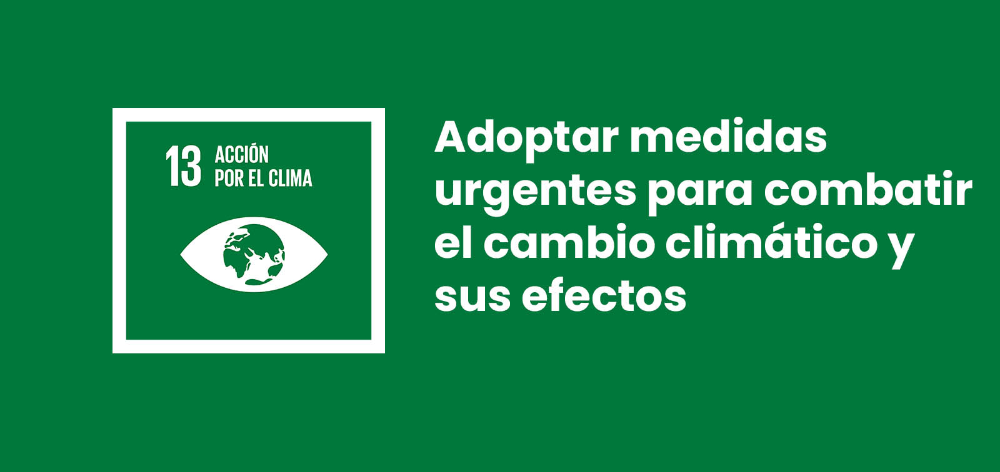

# Tasca 02. Pla de sostenibilitat – Coworking Mataró

**Membres de l'equip:** Marc i Martí  
**Data:** 22/05/2026 

## Introducció

En aquest document Jo i en Marti presentarem el **Pla de Sostenibilitat** per a l'empresa *Coworking Mataró*, una auditoria i proposta de transformació de la seva infraestructura informàtica cap a fer un model d'Economia Circular. L'objectiu principal és **optimitzar el rendiment tècnic dels equips, reduir l'impacte ambiental i disminuir la factura elèctrica 

### els ODS i la empresa coworking

Aquest pla nosaltre l'hem enfocat en els ODS com per exemple el:

*   **ODS 9 – Indústria, Innovació i Infraestructura:** Aposta per una infraestructura TIC resilient i sostenible mitjançant la revitalització d'equips existents.

*   **ODS 12 – Producció i Consum Responsables:** Implementa l'Economia Circular allargant la vida útil del maquinari i reduint la generació de residus electrònics.

*   **ODS 13 – Acció pel Clima:** Minimitza la petjada de carboni reduint el consum energètic de l'empresa.

## Fase 1: Diagnòstic i Auditoria

